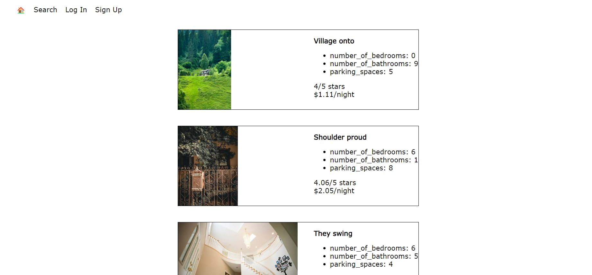
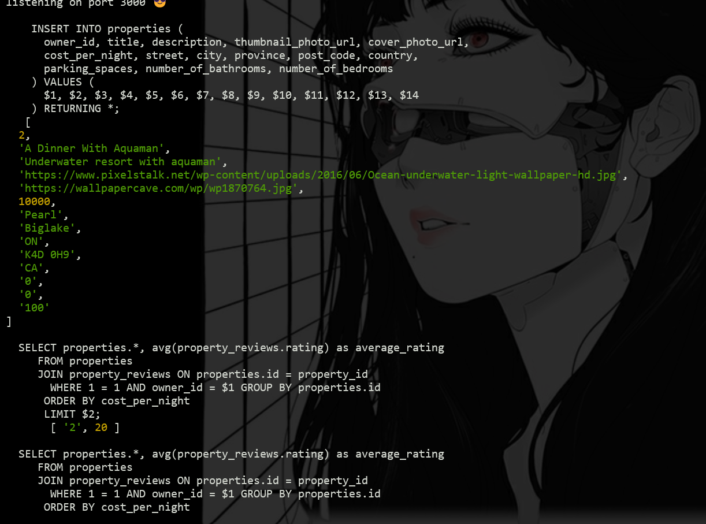
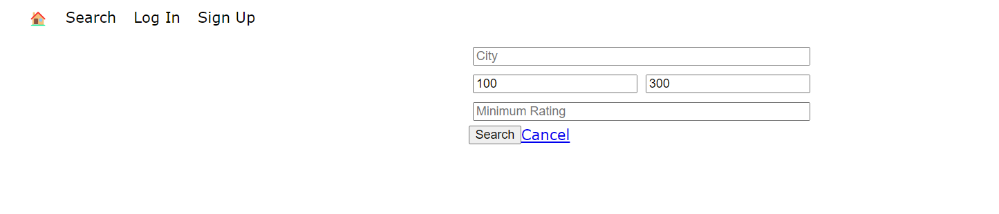

# LightBnB
By Anthony

A simple multi-page Airbnb clone that uses a server-side Javascript to display the information from queries to web pages via SQL queries.

---
#### SETUP


Go into the `LightBnB` folder.
<br>
<br>
Start PSQL with this command `startpostgres`.
<br>
<br>
Enter command `psql -h localhost -p 5432 -U labber lightbnb`.
<br>
<br>
The password is `labber`.
<br>
<br>
Create the database with :

```
\i migrations/01_schema.sql
\i seeds/01_seeds.sql
\i seeds/02_seeds.sql;
```

It may take a while to create the table.
<br>
<br>
Enter `cd LightBnB_WebApp` in the `/LightBnB` directory. 
<br>
<br>
Enter `npm install` to install all dependencies.
<br>
<br>
Start the server with `npm run local`.
<br>
<br>
Go to `localhost:3000` in your browser
<br>

---

<br>

#### PREVIEW






---